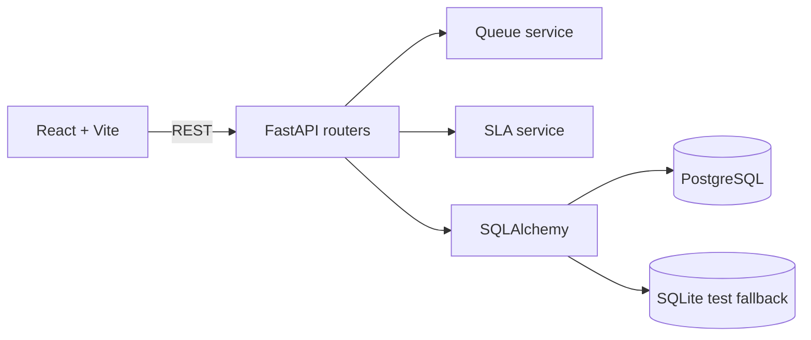

# Smartdesk

SLA-aware IT helpdesk queue for teams that need the next best ticket to be obvious. The queue is calculated by the FastAPI backend, not by the browser: overdue active work always leads, then urgent priority, nearest deadline, oldest creation time, and ticket ID as a deterministic tie-breaker. Resolved tickets never compete with operational work.

## What is included

- FastAPI + SQLAlchemy 2.x domain API with PostgreSQL configuration and SQLite fallback for quick local testing.
- Dedicated SLA and queue services with timezone-aware deadline handling and generated queue explanations.
- React/Vite/Tailwind dashboard with live countdown labels, search, status/priority filters, pagination, CSV export, customer directory, ticket detail activity, and create-ticket flow.
- Normalized customers, agents, tickets, and ticket activities with useful indexes.
- Alembic initial migration, realistic seed data (11 customers, 6 agents, 55 tickets), Docker Compose PostgreSQL, and pytest queue coverage.

## Architecture



## Run locally

Requirements: Python 3.11+ and Node 20+. Python 3.14 is supported by the current dependency pins.

```bash
cp .env.example .env
docker compose up -d postgres
python -m venv .venv && source .venv/bin/activate
pip install -r backend/requirements.txt
alembic -c backend/alembic.ini upgrade head
PYTHONPATH=backend python backend/seed.py
PYTHONPATH=backend uvicorn app.main:app --reload --port 8000
```

In a second terminal:

```bash
npm install --prefix frontend
npm run dev --prefix frontend
```

Open `http://localhost:5173`. For a zero-setup demo, omit Docker and `.env`; the backend defaults to `sqlite:///./helpdesk.db`.

## Codespaces

Open the repository in Codespaces, run the local commands above, and forward ports 5173 and 8000. The included `docker-compose.yml` provides only the required PostgreSQL service; optional infrastructure is intentionally absent until core queue behavior is proven.

## API overview

| Method | Endpoint | Purpose |
| --- | --- | --- |
| GET | `/api/tickets` | Filter, queue-order, and paginate tickets |
| GET | `/api/tickets/export` | Export the same filtered ordered set as CSV |
| GET | `/api/tickets/{id}` | Ticket details |
| POST | `/api/tickets` | Create a ticket and initial activity |
| PATCH | `/api/tickets/{id}` | Update ticket fields and log changes |
| PATCH | `/api/tickets/{id}/assign` | Assign or unassign |
| PATCH | `/api/tickets/{id}/status` | Change status |
| PATCH | `/api/tickets/{id}/priority` | Change priority |
| GET | `/api/tickets/{id}/activities` | Activity history |
| GET | `/api/customers?q=` | Customer search |
| GET | `/api/customers/{id}` | Customer history and counts |
| GET | `/api/agents` | Active agents |
| GET | `/api/dashboard/stats` | Dashboard counts |

All list endpoints apply `FILTER -> QUEUE ORDER -> PAGINATION`. SLA deadlines are persisted once at creation using `URGENT = 2h`, `HIGH = 8h`, and `NORMAL = 24h`; overdue state is evaluated against the persisted deadline at request time. Each queue/stats read automatically runs the escalation check: breached `NORMAL` tickets move to `HIGH`, and breached `HIGH` tickets move to `URGENT`, never more than one level per run. Every escalation is logged as ticket activity, and the original SLA deadline is preserved.

## Tests

```bash
PYTHONPATH=backend python -m pytest backend/tests -q
npm run build --prefix frontend
```

The queue tests cover overdue precedence, priority, deadline and age tie-breakers, exact deadline behavior, and resolved exclusion. Escalation tests cover one-level progression, activity logging, deadline preservation, and resolved exclusion. The seeded demo intentionally shows overdue normal tickets ahead of non-overdue urgent tickets.

## Environment

See `.env.example`: `DATABASE_URL`, `CORS_ORIGINS`, and `VITE_API_URL`. Never commit a real `.env` or database credentials.

## Future improvements

Authentication and role permissions, WebSocket queue updates, Redis caching, background SLA notifications, richer bulk actions, and a full API integration test suite can be added after the core workflow.